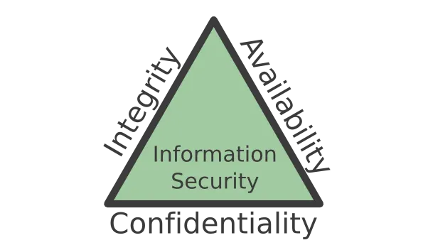

Understanding what Integrity, Authentication, and Non-Repudiation are, and how we guarantee those properties when sending information to somebody else.




So let’s say you send messages to your friends through your own personal communication channel, you won’t send confidential information so you really don’t care if someone else sees it, however, you want to receive exactly what your friends send to you, you don’t want to receive something else. And sometimes, you really want to guarantee that it was that specific friend who sent you that message.

The code used in the examples was written in Java, using the JCA (Java Cryptography Architecture).

## Integrity

Integrity is the absence of an invalid system or data modifications by non-authorized parties.

How can we guarantee the integrity of the data that we sent through our communication channel?

Let’s split the procedure into two major parts:
* The sender should protect the data to send;
* The receiver must verify if the received data wasn’t tampered.

Let’s say we just want to guarantee that the data was no tampered(we don’t care about the identity of the sender for now).

Let’s introduce the idea of hash functions.

A.k.a. cryptographic hash functions or collision-resistant hash functions
* Do not confuse with hash functions used in hash tables data structures;
* They are cryptographic, but not cyphers.
* Are not used to encrypt;
* Example: SHA2.

Hashes don’t require a key, as we can see in the following code, we are using SHA-256, which will generate a hash with a fixed size(256 bits).

```java
public byte[] hash(byte[] dataBytes) throws NoSuchAlgorithmException {
 MessageDigest sha256 = MessageDigest.getInstance(“SHA-256”); 
 byte[] dataHash = sha256.digest(dataBytes);
 return dataHash;
}
```
After generating the hash, what the sender should do is send the message with the hash.

Let’s say M is the data, and H is the hash of M.
The sender should send MH through the communication channel.

The receiver on the other end received M’H. M’ means the received message bytes, which could have been tampered.

The receiver should hash M’, generating H’, then he should compare H with H’, if they both match, the message wasn’t tampered.


## Authentication

If we want to guarantee authentication, there must be a certain something which can authenticate the sender of a message.

That something is a symmetric key, a key which can be used to cypher and decypher in symmetrical ciphering algorithms.

In the previous example, we used a hash, which didn’t require any sort of key, however, now we want to authenticate the sender, and for this, we’ll use a MAC (Message Authentication Code).

As in the previous example, we send the message + MAC.

For this, we’ll use a Hash-based MAC (hash of data and secret value).
It requires only a hash — more efficient
– Example: `HMAC-SHA2`

```java
public byte[] mac(byte[] dataBytes) throws NoSuchAlgorithmException {
  Key key = getKey(keyFilePath);
  // get a MAC object and print the provider
  Mac mac = Mac.getInstance(“HmacSHA256”); 
  //Creating Mac …
  mac.init(key);
  return mac.doFinal(dataBytes);
}
```

Let’s say **M** is the data, and **H** is the MAC of **M**, using the key **K**.
The sender should send **MH** through the communication channel, the receiver on the other end received **M'H**. **M'** means the received message bytes, which could have been tampered.

The receiver should produce the MAC of **M'**, using the same key **K**, generating **H'**, then he should compare **H** with **H'**, if they both match, the message wasn’t tampered.

With this, we can authenticate the user, and check if the sent data was not changed.


# Non-Repudiation

We want to guarantee all the previous properties, and also, guarantee that the sender cannot say that he wasn’t the one who sent that message.
So we want:
* Authenticate the content of a document;
* Authenticate its signer;
* Being able to assure authentication towards a third party;
* Signer cannot repudiate the signature.

With this comes the notion of Digital Signature.

Digital Signature uses asymmetrical keys, a public key and a private key.

The public key can be public and shared among other people, however, only the owner of the private key can have it.

We use the private key to sign the hash of the data, which allows saying that only the owner of the private key could sign that data, meaning that that person can’t deny signing.

**Get Signature**
```java
public static byte[] generateDigitalSignature(byte[] data, String privateKeyFilePath) throws Exception {
     Key privateKey = readPrivateKey(privateKeyFilePath);
     Signature signature = Signature.getInstance(“SHA256withRSA”);
     signature.initSign(privateKey);
     signature.update(data);
     byte[] sign = signature.sign();
    return sign;
 }
```

**Verify Signature**
```java
public static boolean verifySignature(byte[] messageBytes, byte[]        dataSignature, String publicKeyFilePath) throws Exception{
     Key publicKey = readPublicKey(publicKeyFilePath);
     Signature signature = Signature.getInstance(“SHA256withRSA”);
     signature.initVerify(publicKey);
     signature.update(messageBytes);
     return signature.verify(dataSignature);
 }
```

## Summary
The are many properties we may want to preserve while sending messages through the many communication channels. They are usually incremental, which means if we want to add a new property, we usually guarantee the previous ones.

The following table is a summary of the whole post.
```
Cryptographic primitive | Hash |    MAC    | Digital
Security Goal           |      |           | signature
------------------------+------+-----------+-------------
Integrity               |  Yes |    Yes    |   Yes
Authentication          |  No  |    Yes    |   Yes
Non-repudiation         |  No  |    No     |   Yes
------------------------+------+-----------+-------------
Kind of keys            | none | symmetric | asymmetric
                        |      |    keys   |    keys
```

This was my first post, so I hope that you enjoyed it.

Original Post: [Message Integrity, Authentication, and Non-Repudiation
](https://dev.to/rodrassilva/message-integrity-authentication-and-non-repudiation-3d98)